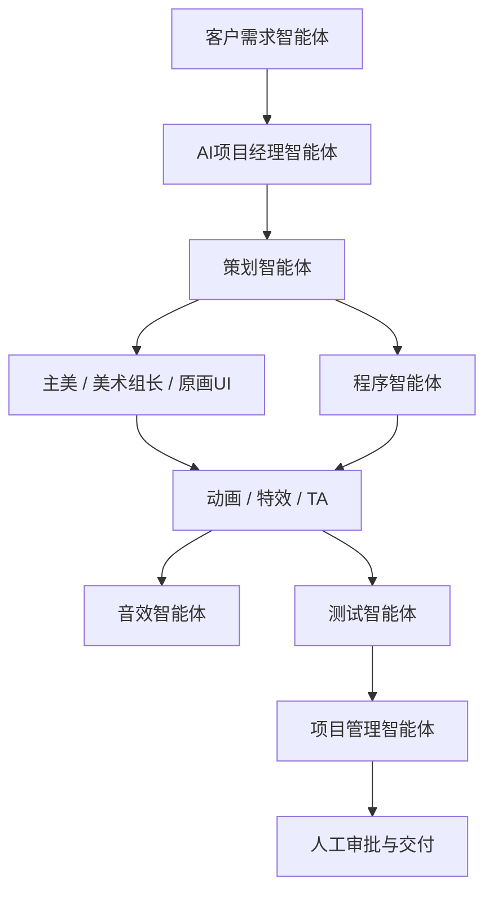

# 全链路日常使用流程

这份流程用于告诉团队每天应该在哪个窗口做什么，以及不同智能体之间怎么交接。

## 标准项目链路



## 一次新项目的正确打开方式

1. 在 `01-客户需求智能体` 输入客户原始需求。
2. 客户需求智能体输出项目立项书和各岗位触发指令。
3. 把立项书复制给 `02-AI项目经理智能体`。
4. AI项目经理拆出各岗位任务顺序和风险点。
5. 按项目经理的任务，把对应片段分发给策划、美术、程序、测试和项目管理窗口。
6. 每个岗位产出初稿后，回传给 `02-AI项目经理智能体` 做方向审查。
7. 需要人工拍板的事项，由项目负责人确认。
8. 所有可复用输出进入 `03_数字资产库`。

## 策划成员 A/B/C 的日常对话方式

### 成员 A：Slot 策划负责人

使用窗口：`T-A-成员A训练数据-Slot策划方向`

建议每天沉淀：
- Slot 主题判断
- 特色功能取舍
- RTP 和奖池讨论
- 竞品分析
- 策划案评审意见

### 成员 B：文审机项目负责人

使用窗口：`T-B-成员B训练数据-文审机策划方向`

建议每天沉淀：
- 生肖角色设计
- 多人竞技规则
- 平衡性判断
- 关卡难度和胜负判定

### 成员 C：策划执行层

使用窗口：`T-C-成员C训练数据-策划执行层通用`

建议每天沉淀：
- 策划文档写法
- 需求拆解
- 会议纪要
- 日报周报
- 跨岗位沟通记录

## 每天结束前的归档动作

每个训练数据窗口都要让 AI 输出以下内容：

```markdown
【任务类型】
【业务线】
【可蒸馏经验点】
【质量星级】
【是否进入蒸馏】
【建议归档标题】
```

质量星级建议：
- 一星：普通记录，只留档。
- 二星：有明确经验，可进入蒸馏候选。
- 三星：高价值判断，优先进入蒸馏。

## 每周负责人检查动作

- 检查训练数据是否连续积累。
- 检查是否有低质量数据混入蒸馏候选。
- 检查 Demo V0 输出和评分表是否完整。
- 检查评分最低的 3 个岗位是否正在优先训练。
- 检查数字资产库是否有新增资产和评级。

